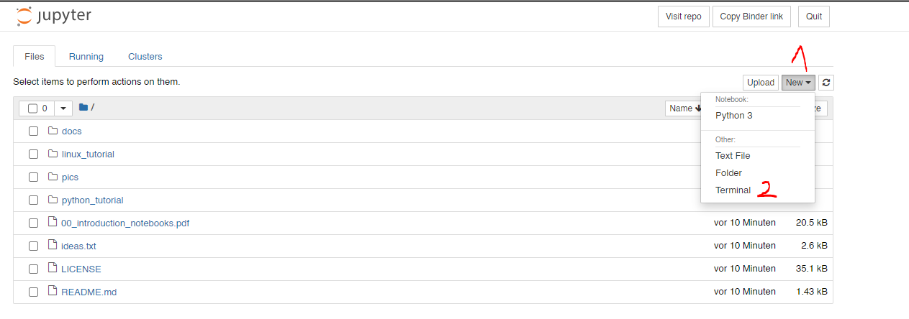

 .. _linux-tutorial-label:

.. role:: bolditalic
  :class: bolditalic

.. role:: boldcode
  :class: boldcode

.. role:: italiccode
  :class: italiccode

==============
Linux tutorial
==============

Linux is an open-source operating system, first released in 1991. Linux is what's running on virtually all supercomputers and cluster all over the world. Linux is very modular and comes often as the underlying software of so-called distributions. Such distributions are the popular Ubuntu/Debian Family, of the commercial Red Hat Enterprise Linux distribution. The most significant difference between Windows and Linux for new users is the usage text-only commands. Instead of opening applications or settings pages and working your way through it with a mouse, you just open a terminal and type away.

Credit
======

Credit for this tutorial goes out to Michael Stonebank (http://www.ee.surrey.ac.uk/Teaching/Unix/).

I took his tutorial and added exercises with automated resolve scripts.

Typographical conventions
=========================

We will use the following typographical conventions:

* Characters written in ``typewriter font`` are commands that can be typed into the command line on the computer.
* Characters written in :italiccode:`italic typewriter font` indicate a non-specific file or directory (i.e. folder names).
* Words inserted within square brackets indicate :boldcode:`[Ctrl]` indicate keys to be pressed.

Don't forget to press the enter key. Commands are not sent to the computer until this is done.

The linux (UNIX) operating system
=================================

An operating system is a piece of software that manages a computer's hardware and software resources and provides services to other computer programs.

.. image:: _static/pics/linux_tutorial/unix_like_os_tree.png
   :target: _static/pics/linux_tutorial/unix_like_os_tree.png
   :alt: Inheritance of Unix-like operating systems.

As you can see on this graphic (visit the documentation page under https://kevinsawade.github.io/start-science-here/linux_tutorial.html, if the image does not render). The UNIX operating system dates back all the way to 1970. You can also see, that Apple's current Mac OS X inherits parts from early UNIX. The listed operating systems are called UNIX-like OSes and share a lot of common features. In general, a UNIX system is made up of three parts: kernel, shell and programs.

The kernel
----------

The kernel of UNIX is the hub of the operating system: it allocates time and memory to programs and handles the filestore and communications in response to system calls.

As an illustration of the way that the shell and the kernel work together, suppose a user types ``rm myfile`` (which has the effect of removing the file myfile). The shell searches the filestore for the file containing the program ``rm``\ , and then requests the kernel, through system calls, to execute the program ``rm`` on myfile. When the process ``rm myfile`` has finished running, the shell then returns the UNIX prompt $ to the user, indicating that it is waiting for further commands.

The shell
---------

The shell acts as an interface between the user and the kernel. When a user logs in, the login program checks the username and password, and then starts another program called the shell. The shell is a command line interpreter (CLI). It interprets the commands the user types in and arranges for them to be carried out. The commands are themselves programs: when they terminate, the shell gives the user another prompt.

**Background info: shell, terminal, console**

Skip this part if you don't care for the terminology of these words.

* **Terminal**\ : A device file, that allows command execution beyond read and write. Terminals are provided by the kernal on behalf of a hardware device (keyboard key presses are presented on screen and output can also be printed). Often Terminal emulators are provided through an extra layer to the kernel. Such emulators are: ssh, screen, tmux and the graphical applications that allow you to type into a window and execute commands.
* **Console**\ : A physical device with which commands will be sent to a computer (teletype writers in shorthand tty). The console appears to the computer as a kernel-implemented terminal. Most linux machines come with multiple consoles (ttys), from which one is used to run graphical applications.
* **Command line**\ : An interface where a user types commands.
* **Shell**\ : A shell is the interface that users see, when they log in. The shell is what starts other programs and defines the syntax with which programs are started. Because these *commands* are entered to the shell in Linux, the command-line can also be referred to as a command-line-shell.

Files and processes
-------------------

Everything in Linux is either a file or a process.

A process is an executing program identified by a unique PID (process identifier).

A file is a collection of data. They are created by users using text editors, running compilers etc.

Examples of files:

* a document (report, essay etc.)
* the text of a program written in some high-level programming language
* instructions comprehensible directly to the machine and incomprehensible to a casual user, for example, a collection of binary digits (an executable or binary file);
* a directory, containing information about its contents, which may be a mixture of other directories (subdirectories) and ordinary files.

The directory structure
-----------------------

All the files are grouped together in the directory structure. The file-system is arranged in a hierarchical structure, like an inverted tree. The top of the hierarchy is traditionally called **root**. A directory is nothing more than a special file that tells us what's inside that directory (other files or directories). These "directory files" get a slash (\ ``/``\ ) added to them to keep them separate from regular files. By combining multiple directories with slashes we can create paths, that point to files. Consider this example:

.. code-block::

   .
   ├── binder/
   ├── docs/
   ├── linux_tutorial/
   │   ├── README.md
   │   ├── tutorial_00/
   │   │   ├── get_results.py
   │   │   └── ....
   │   ├── tutorial_01/
   │   │   └── get_results.py
   │   └── ...
   ├── python_tutorial/
   ├── README.md
   └── requirements.txt

You can easily tell the directory ``docs/`` from the file ``requirements.txt``. If you want to refer the the ``get_results.py`` file in the ``tutorial_00`` directory, you can create a path like so: ``linux_tutorial/tutorial_00/get_results.py``.

In the diagram above, we see that the directory ee51ab contains the subdirectory unixstuff and a file proj.txt

Opening a terminal on binder
============================

The easiest way to start your first terminal is to head over to binder and select New and then Terminal.

https://mybinder.org/v2/gh/kevinsawade/start-science-here/HEAD

The prompt
==========

You are now greeted by the *prompt*. The *prompt* looks like this:

.. code-block:: bash

   jovyan@jupyter-kevinsawade-2dstart-2dscience-2dhere-2dd2sbp0zb:~$

This somewhat unusual prompt comes from us using a terminal on a webpage (there are some obstacles associated when using a terminal completely portable on a browser). The *prompt* is normally built like this:

.. code-block:: bash

   username@hostname:~$

The *prompt* contains useful information, such as your username, the name of the computer (\ ``hostname``\ ) and your current directory. The tilde symbol (~) shows you, that you are in your home directory. To make sure, that you are in your home directory you can print your current working environment by calling your first command. Sometimes the dollar sign ($) is prefixed to commands that you should execute on a linux shell to prevent any confusions with other programs / shells.

The other command prompts are listed below:

* ``$``\ : Linux shells in general, ``bash`` in particular.
* ``>>>``\ : Python
* ``>``\ : Windows command prompt or windows power shell
* ``%``\ : Tcl

But that's enough of that. Now we want to make sure we are in our home directory. Enter this command (without the dollar sign), hit the enter key and observe the output:

.. code-block:: bash

   $ pwd
   /home/jovyan

Success! You are in your home directory. We can continue with our Linux Tutorial.

Changing directories
====================

We will now start with the first exercise. Please use the ``cd`` command/program to change your current directory to the ``linux_tutorial/tutorial_00/`` directory:

.. code-block:: bash

   $ cd linux_tutorial/tutorial_00

``pwd`` should now return a different working directory.

.. code-block:: bash

   $ pwd
   /home/jovyan/linux_tutorial/tutorial_00

Tutorials
=========

.. toctree::
   :maxdepth: 2

   linux_tutorial_00
   linux_tutorial_01
   linux_tutorial_02
   linux_tutorial_03
   linux_tutorial_04
   linux_tutorial_05
   linux_tutorial_06
